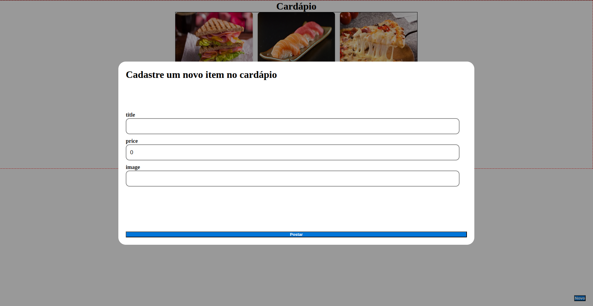

# Food Menu - Full Stack Application

### Backend


### Frontend


---

# Project Description

**food-menu** is a full-stack web application developed to practice modern backend and frontend development concepts using a real client-server architecture.

The application allows users to create and manage food dishes through a modern web interface. Each dish contains:

- **Name**
- **Price**
- **Image URL**

The system demonstrates how a React frontend communicates with a Spring Boot REST API to persist and retrieve data from a PostgreSQL database.

This project was built as part of my software development portfolio to demonstrate practical skills in:

- Full-stack development
- REST API creation
- Database integration
- Frontend-backend communication
- Modern JavaScript and Java ecosystems

---

# Application Preview



---

# Project Structure

```text
food-menu
├── backend
│   ├── src/main/java
│   ├── src/main/resources
│   └── pom.xml
│
├── frontend
│   ├── src
│   ├── public
│   └── package.json
│
└── README.md
```

---

# Features

The application provides the following functionality:

- Create new food dishes
- Upload/store dish image URLs
- Display all registered dishes
- Persist dish data in PostgreSQL
- Communication between frontend and backend using HTTP requests

Each dish contains:

- **Id**
- **Title**
- **Image**
- **Price**

---

# Architecture Overview

The project follows a client-server architecture.

```text
Frontend (React + TypeScript)
│
│ HTTP Requests (Axios)
▼
Backend API (Spring Boot)
│
▼
PostgreSQL Database
```

The frontend communicates with the backend through REST API endpoints, while the backend handles business logic and database persistence.

---

# Frontend

The frontend was built using modern JavaScript tooling and libraries.

## Technologies

- **React**
- **TypeScript**
- **Vite**
- **Axios**

## Responsibilities

The frontend application:

- Displays the list of dishes
- Provides a form to create new dishes
- Sends HTTP requests to the backend API
- Dynamically updates the user interface
- Manages application state and asynchronous requests

---

# Backend

The backend is a REST API built with Spring Boot.

## Technologies

- **Java**
- **Spring Boot**
- **PostgreSQL**
- **Flyway**
- **Maven**

## Responsibilities

The backend:

- Exposes REST endpoints
- Receives and validates HTTP requests
- Persists dish data into PostgreSQL
- Handles database migrations with Flyway
- Returns JSON responses to the frontend

---

# API Endpoints

| Method | Endpoint | Description |
|------|------|------|
| GET | `/food` | Retrieve all dishes |
| POST | `/food` | Create a new dish |

---

# Database

The project uses PostgreSQL as the relational database management system.

Database schema versioning and migrations are managed using Flyway, allowing reproducible and version-controlled database changes.

Example dish entity:

```json
{
  "id": 1,
  "title": "Pizza",
  "image": "https://example.com/pizza.png",
  "price": 49
}
```

---

# Running the Project

## Backend

1. Start PostgreSQL
2. Configure database credentials in:

```text
application.properties
```

3. Run the Spring Boot application

Example:

```bash
./mvnw spring-boot:run
```

---

## Frontend

1. Navigate to the frontend folder

```bash
cd frontend
```

2. Install dependencies

```bash
npm install
```

3. Start the development server

```bash
npm run dev
```

---

# Purpose of the Project

This project was developed to practice and demonstrate:

- Full-stack application development
- REST API development with Spring Boot
- Frontend development with React and TypeScript
- Database integration with PostgreSQL
- Database migrations using Flyway
- HTTP communication using Axios
- Modern project structure and tooling

---

# Future Improvements

Possible future enhancements for the project:

- Edit and delete dishes
- Image upload support
- Authentication and authorization
- Docker containerization
- Deployment to cloud platforms
- Unit and integration testing

---

# Author

Developed by **Joabe Barbosa**

### 🤝 Connect with me:

[](https://www.linkedin.com/in/joabe-barbosa-64636b1a8/)

[](https://www.instagram.com/quant_code/)
